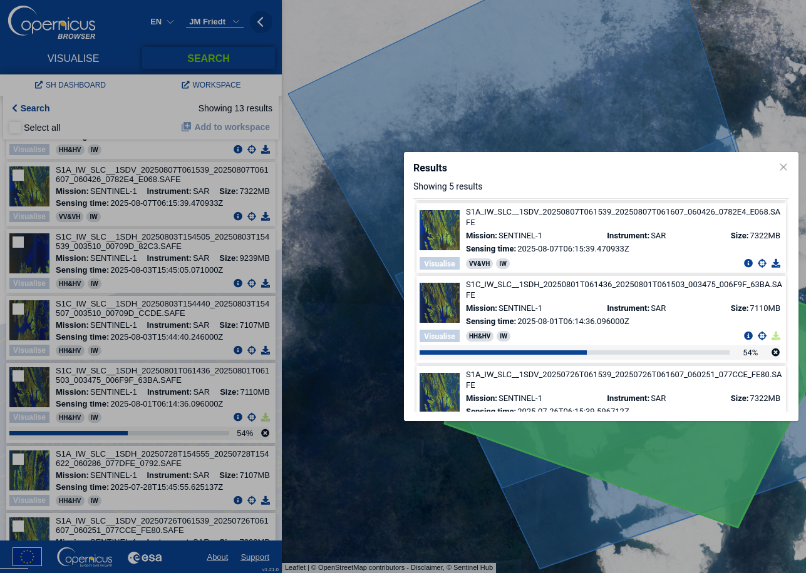
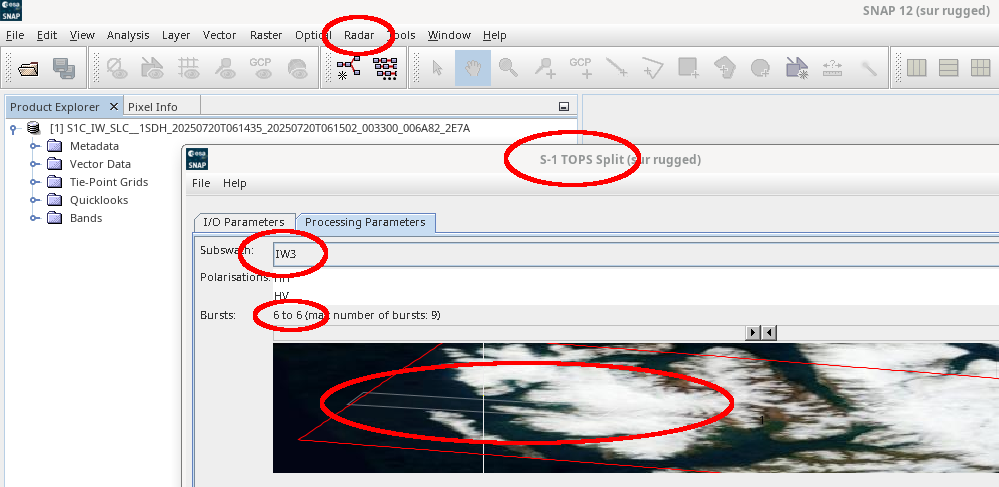

## Scripts for automated processing of Sentinel-1 level-1 datasets

Using SNAP's command line tool ``gpt`` to automate processing of datasets
downloaded from https://dataspace.copernicus.eu/browser

Settings tuned for Brogger peninsula, Svalbard, to produce the datasets
presented in  
<a href="https://www.mdpi.com/2072-4292/15/7/1858">J.-M Friedt, E. Bernard, M. Griselin Ground based oblique view photogrammetry and Sentinel1 spaceborne RADAR reflectivity snow melt processes assessment on an Arctic glacier MDPI Remote Sensing vol. 15 n.7 1858-- (2023)</a>

The magnitude analysis is performed on all ``.zip`` files in the current directory by running 
``go_magnitude.sh`` which uses the settings of ``Makefile_magnitude.templateS1A``.

The InSAR phase analysis is performed on all ``.zip`` pairs of a given satellite (A or C) by
running ``go_phase.sh`` which uses the settings of ``Makefile_phase.templateS1C``.

Tune parameters according to your needs:
* ``firstBurstIndex=6`` and ``lastBurstIndex=6`` of ``IW3`` in ``Makefile_magnitude.templateS1A`` 
for Sentinel1A (also valid for 1C)

* ./DEM.tif for the DEM used for elevation correction

Assumes the ``gdal-bin`` package is installed under the Debian/GNU Linux
to provide ``gdal-translate`` to convert the ``.img`` output to GeoTIFF ready
to be included in QGis. 
