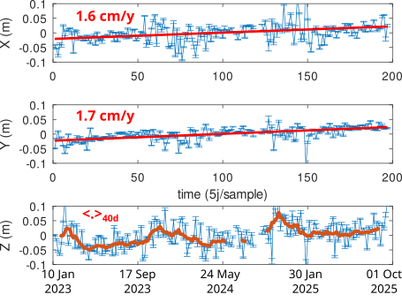

## RTKLib PPP solution

Automated file fetching for Ny-Alesund area GNSS observations, precise
clock (CLK) and orbital parameters (SP3) and navigation data (.nav) online.

After running ``octave go.m`` to fetch and process files, execute from within
GNU Octave ``processall`` to load processed files and plot the resulting chart.

Assumes ``crx2rnx`` from https://terras.gsi.go.jp/ja/crx2rnx.html was compiled from
source and that RTKLib's ``rnx2rtkp`` from https://github.com/Papstors/RTKLIB was 
compiled (``cd RTKLIB/app/consapp/rnx2rtkp/gcc && make``)
