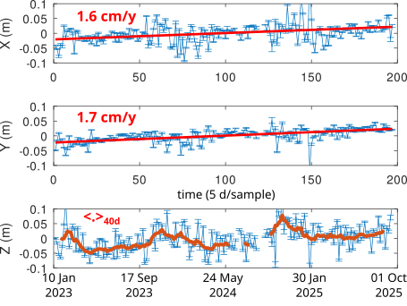

## RTKLib PPP solution

Automated file fetching for Ny-Alesund area GNSS observations, precise
clock (CLK) and orbital parameters (SP3) and navigation data (.nav) online.

After running ``octave go.m`` to fetch and process files, execute from within
GNU Octave ``processall`` to load processed files and plot the resulting chart.

