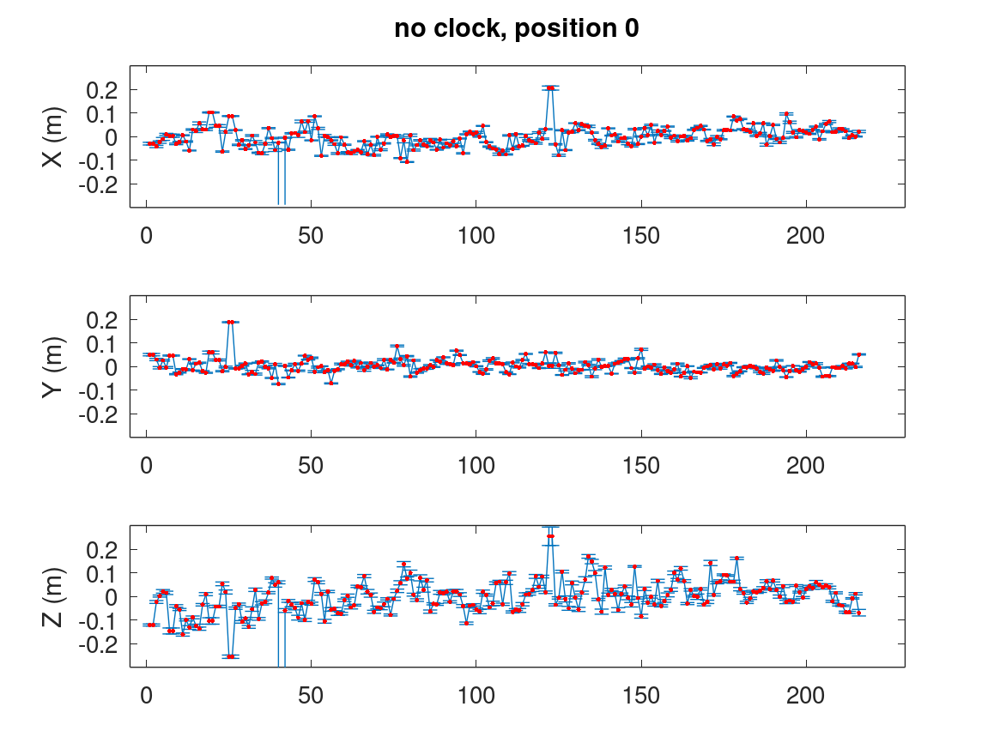
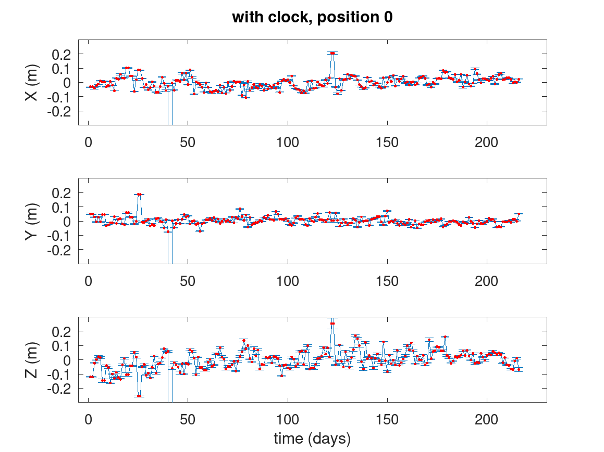
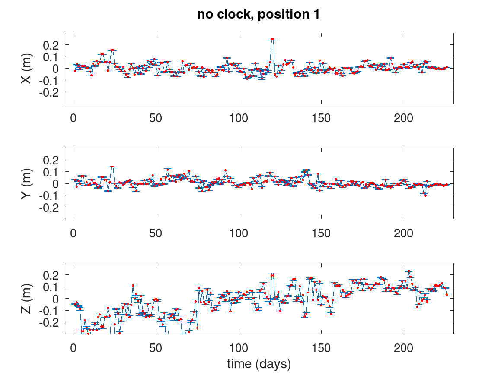
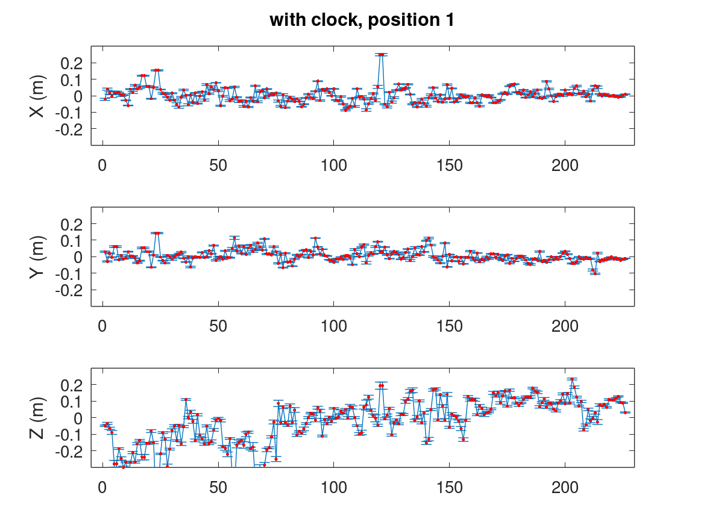
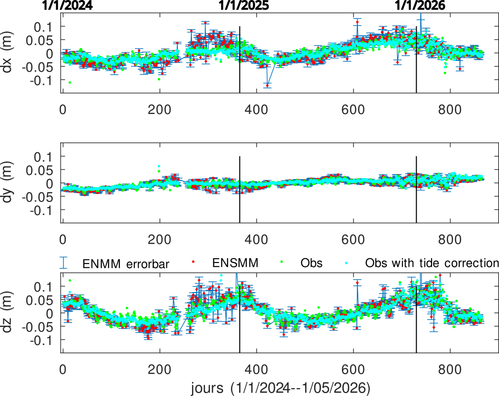
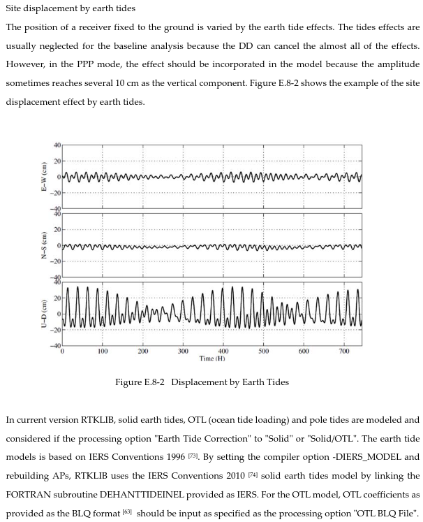

# PPP solution using RTKLib

Rinex 3.05 must be converted to 3.04 (using RTKLib's ``convbin``). 

Compressed RINEX (CNRX) must be converted to RINEX using RNXCMP (4.2.0) found at
https://terras.gsi.go.jp/ja/crx2rnx/RNXCMP_4.2.0_src.tar.gz. We assume that both
the original RTKLib (not the Demo5 version which does not provide a solution when
fed the CLK file) from https://github.com/tomojitakasu/RTKLIB are located at the
same directory level than the folder holding these scripts. Adjust the paths in ``go*.m``
accordingly.

## Ny Alesund datasets

UBX receivers collecting raw ubx files, converted to RINEX using ``convbin`` and processed
with precise orbit SP3 files and clock correction CLK files (no effect). Both SP3 and CLK files
must be renamed ``.sp3`` and ``.clk``. Comparison, for the two receivers named 0 and 1, of the
solution including or not including the precise clock observation, in both cases using the
online SP3 precise orbit and the UBX generated navigation in addition to the observation file.

## ENSMM (Centipede) and Besancon Observatory (IGN RGP)

RINEX resulting from the UBlox receiver ENSMM reference station is stored online at https://renag.resif.fr/pub/centipede_30s/.

According to https://renag.resif.fr/pub/centipede_30s/info.csv: ENSMM Centipede reference station 
is now named A48800FRA

Besancon Observatory IGN RGP station RINEX files are stored at //rgpdata.ign.fr/pub/data_v3/

The default configuration of RTKLib is to **not** correct for Earth tide: adding the
``pos1-tidecorr=1`` option to the configuration file (read as argument of the ``-k`` option
of ``rnx2rtkp``) adds this correction, shown as the light blue/cyan curve above:

